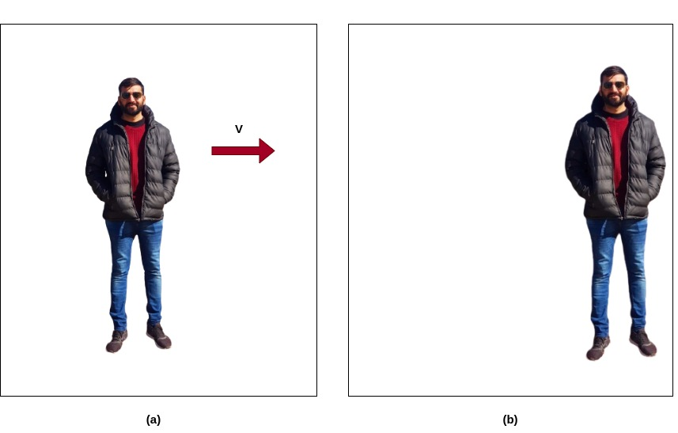
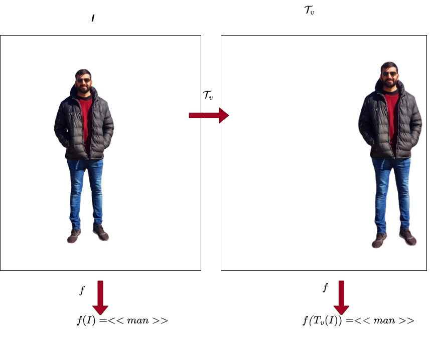
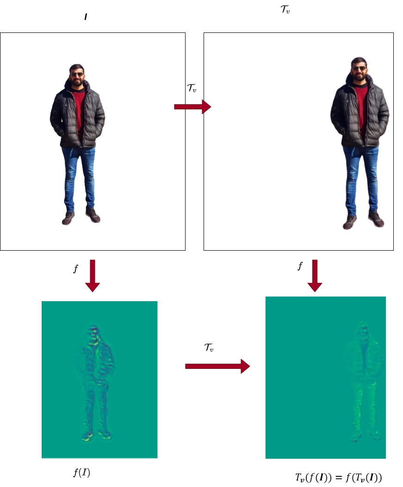

# Translation Invariance and Equivariance in Computer Vision

## 1. Overview

In this tutorial, we’ll explain two common concepts used in computer vision: translation invariance and translation equivariance. First, we’ll recall the mathematical definition of translation. Then we’ll explain the difference between the translation invariance and the translation equivariance by providing illustrative examples.
## 2. What Is Translation?
#### A translation is a geometric transformation that shifts all points in a given direction and by the same distance. Alternatively, it can be interpreted as sliding the origin of the coordinate system by the same amount but in the opposite direction.
The translation can be expressed mathematically as the vector sum of a constant vector  to each point 

In the following example, image (b) was obtained from image (a) by shifting each pixel 150 pixels to the left:

## 3. Translation Invariance
A certain property is translation invariant if it doesn’t change under any translation. Let’s consider the images above. We can recognize a man in both images even though the pixel values were shifted. An image classifier should predict the label “man” for both images. In fact, the classifier output should not be influenced by the position of the target. Hence, the output of the classifier function is translation invariant.
In the following figure, we illustrated schematically the translation invariance of an image classifier, whose classifier function is denoted as f: 

## 4. Translation Invariance
Translation equivariance is a property often confused with translation invariance. So let’s recall the mathematical definition of equivariance.
A function f is said equivariant to a function g if and only if:

In other words, f is equivariant to g if the order of application does not change the result of the composite function.

For example, the [convolution operation](https://www.baeldung.com/cs/convolutional-layer-size#convolution-operation) is translation equivariant. In fact, if we apply a translation  to the image   and then perform a convolution f, the resulting response image  will be the same as if we first performed convolution to  and then applied the same translation  to the response .

The translation equivariance of the convolution operation is represented below:

## 5. Translation Invariance and Equivariance in Convolutional Neural Networks
Translation invariance and equivariance are different properties of [Convolution Neural Networks (CNNs)](https://www.baeldung.com/cs/ai-convolutional-neural-networks).

The translation equivariance is obtained by means of the convolutional layers. In fact, if the input image is translated to the right by a certain amount, the feature maps generated by convolutional layers are shifted by the same amount and direction.
CNNs designed for image classification are translation invariant since if we translate the input, then the output label will not be influenced. Translation invariance is obtained in CNNs by means of the [Pooling Layers](https://www.baeldung.com/cs/ai-convolutional-neural-networks#2-pooling-layers). The pooling operation is usually applied to the feature map generated by preceding convolutional layers and non-linear activation functions. Pooling is the substitution of features in a neighborhood with representative statistics, the max or the mean generally. Hence, the location of the original feature is disregarded.

CNNs are not naturally equivariant and invariant to rotation, scaling, and affine transformations. Hence, [Data Augmentation](https://www.baeldung.com/cs/ml-data-augmentation) techniques must be used to make CNNs more robust to such geometric transformations.
## 6. Conclusion
In this tutorial, we reviewed the concepts of translation invariance and translation equivariance, and we provided illustrative examples. Furthermore, we discussed the importance of both properties in the CNNs for image classification.

##  Reference:
[link to Baeldung](https://www.baeldung.com/cs/translation-invariance-equivariance)
